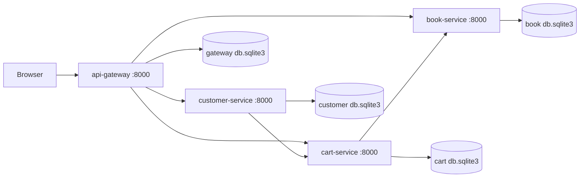

# Architecture Diagram

## System Context

## Design Notes

- Microservice boundary is separated by process and database.
- Inter-service communication uses HTTP REST via requests.
- customer-service POST /customers/ triggers cart-service POST /carts/.
- cart-service POST /cart-items/ validates book existence through book-service GET /books/.
- api-gateway renders HTML pages and delegates business actions to backend services.
